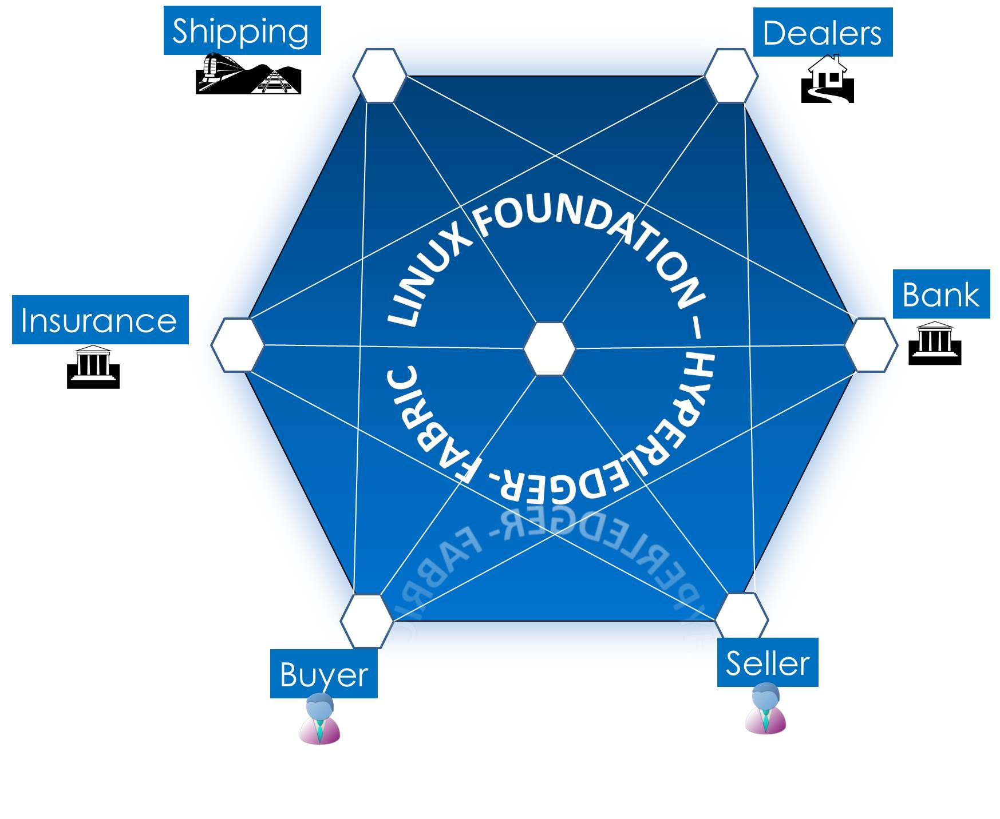

[](http://itpeople-blockchain-auction.readthedocs.io/en/latest/?badge=latest)

#Art Auction Blockchain Application
Credits: Ratnakar Asara, Nishi Nidamarty, Ramesh Thoomu, Adam Gordon and Mohan Venkataraman

**Disclaimer:** The images used in this sample PoC application have been downloaded from publicly available images on the internet, and the copyright belongs to the respective owners. The usage here is strictly for non-commercial purposes as sample data. We recommend that users create their own sample data as appropriate. All names, addresses and accounts numbers used in the sample data are fictitous. The information provided in this README.md is subject to change.

##Introduction

This Hyperledger/Fabric is an implementation of blockchain technology, leveraging familiar and proven technologies. It is a modular architecture allowing pluggable implementations of various function. It features powerful container technology to host any mainstream language for smart contracts development. Chaincode (smart contracts) or blockchain applications run on the fabric. Chaincode is written in Go language 

The original intention of this application was to understand how to write a Go application on the Hyperledger/Fabric. This initial version was written to understand the different chaincode api's, the boundary that separates what goes into the blockchain and what lives within the enterprise application, usage of database features, error management etc. <br> </br>


## Application Description

This application deals with auctioning ART on the block chain. The blockchain makes sense here as there are many different stakeholders and can leverage the benefits of the "Network Effect". This application deals with the following stake holders:
* Buyers and Sellers or Traders (TRD)
* Banks (BNK)
* Insurance Companies (INS)
* Shipping and Forwarding (SHP)
* Auction Houses (AH)
* Art Dealers (DEL)
* Artists (ART)

The typical business process is shown below


###Registering Stakeholder Accounts

Artists, Traders, Dealers own **Assets** (Items). Auction Houses, Banks, Insurance Companies and Service Providers play a role in the auction process. To conduct business on the block chain, the stakeholder has to open an account on the block chain. In the production world, prior to opening an account, all of the stake-holder details may be authenticated by another blockchain like an IDaaS (Identity-as-a-Service). There are various stake holders as listed above, each with a different interest.

###Registering Assets or Items

The Seller (Trader) who owns **Assets** must register the asset on the block chain in order to conduct business. When an **Asset** is submitted for registration, the chaincode does the following:
   * Checks if the owner has a registered account
   * Converts any presented "Certificate of Authenticity" or a credibly issued image to a byte stream, generates a key, encrypts the byte stream using the key and stores the image on the BC 
   * Provides the key to the **owner** for safe keeping and future reference
   * Makes entries into the Item History so that the lifecycle of the Asset can be reviewed at any time

###Making a Request to Auction an Asset

When the owner of an Asset sees an opportunity to make money, they would like to auction the Asset. They engage an Auction House and make a **request to auction** the Asset. The request always specifies a **"Reserve Price"**. Sometimes, the owner may additionally specify a **"Buy It Now"** price as well. When the request is made, the item, owner and the auction house are all validated. (The chaincode simply validates that they are all registered on the BC).

The Auction House will most likely, behind the scene, get the Asset authenticated and determine the valuation before deciding to accept the item. One of the ways by which they could do some preliminary authentication is to request the **seller** to enter his **private key**, account-id and the registered item number into the client application. While the item number and account identifier is a straight validation, the key will be used to decrypt and retrieve the stored "certificate of authenticity or image". The state of the Auction is set to **INIT** at this point, until the Auction House is ready to **OPEN** the Asset for bids.

###Opening the Auction for Bids

The Auction House will choose a time frame to place the item on auction and **OPEN** it up for accepting bids from potential Buyers. They may, if applicable, advertise the **BuyItNow** price.

### "Buy It Now" and Accepting Bids

During the window of the auction, potential buyers can place bids. If a Buyer wishes to exercise the "Buy It Now", they can buy the item right away provided there is no bid higher than the "BuyItNow" price.

Bids are accepted from buyers if
   * The Bids have are equal or greater than the **Reserve Price"**
   * The auction is still **OPEN**
   * The Buyer has a registered account

### Buy It Now

When a buyer chooses this option, the chain code does the following
    * Validates the Buyer
    * Checks if there are any bidders whose bid is higher than the **"Buy It Now"** price. If so, the offer is rejected
    * If the **"Buy It Now"** price is applicable, it immediately **"CLOSES"** the auctions, creates a **transaction**
    * It assigns the Asset to the new owner
    * It also generates a new **Key**, re-encrypts the "Certificate of Ownership or Image", and provides the key to the new buyer
    * The new price of the Asset is set to the **"Buy It Now"** price if not higher

### Auction Expiry

When the auction expires, the Auction House retrieves the highest bid and converts it to a **transaction** ( A transaction in the real world could mean creating insurance and shipping docs, collecting payments and commissions, issuing a new title or certificate to the new owner etc.), transfers ownership to the buyer and updates the price with the new **"Hammer"** price. It also generates a new **Key**, re-encrypts the "Certificate of Ownership or Image", and provides the key to the new buyer.

### Transfer an Item to another User

The chain code supports this scenario, by allowing a **owner** of an Asset to transfer **"ownership"** to another person. The receiving person has to be registered on the block-chain. Currently the chain code does not execute any regulatory or compliance rules.

### Validating Asset Ownership

The chain code supports this. In order to accomplish this, it does preliminary authentication by requesting the **seller** to enter his **private key**, account-id and the registered item number. While the item number and account identifier is a straight validation, the key will be used to decrypt and view the stored **"Certificate of Authenticity or image"**. If decryption fails, then it assumes that the owner is not the legal owner of the Asset.

## APIs Available
The following Invoke and Query APIs are available from both CLI and REST, and have the following signature

    func(stub *shim.ChaincodeStub, function string, args []string) ([]byte, error) 

### Invoke
                * PostUser 
                * PostItem
                * PostAuctionRequest
                * PostTransaction
                * PostBid
                * OpenAuctionForBids
                * BuyItNow
                * TransferItem
                * CloseAuction
                * CloseOpenAuctions
### Query
                * GetItem
                * GetUser
                * GetAuctionRequest
                * GetTransaction
                * GetBid
                * GetLastBid
                * GetHighestBid
                * GetNoOfBidsReceived
                * GetListOfBids
                * GetItemLog
                * GetItemListByCat
                * GetUserListByCat
                * GetListOfItemsOnAuc
                * GetListOfOpenAucs
                * ValidateItemOwnership
                * IsItemOnAuction

##Environment Setup

Please review instructions on setting up the [Development Environment](https://github.com/hyperledger/fabric/blob/master/docs/dev-setup/devenv.md) as well as the setting up the [Sandbox Environment](https://github.com/hyperledger/fabric/blob/master/docs/Setup/Chaincode-setup.md) to execute the chaincode.

## Running the Application

**Cloning the auction app**
```
 cd $GOPATH/src/github.com/hyperledger/fabric
 git clone https://github.com/<username>/auction.git
```

###Terminal 1
```
 cd $GOPATH/src/github.com/hyperledger/fabric
 make peer
 peer node start --peer-chaincodedev
```

###Terminal 2
```
 cd $GOPATH/src/github.com/hyperledger/fabric/auction/art/artchaincode
 go build
 CORE_CHAINCODE_ID_NAME=mycc CORE_PEER_ADDRESS=0.0.0.0:30303 ./artchaincode dev
```
###Terminal 3
```
 cd $GOPATH/src/github.com/hyperledger/fabric/auction/art/scripts
```
###Run the following shell scripts

The scripts are provided for the convenience of understanding how to use the application as well as testing in your specific cloned environment. The scripts execute all API calls in CLI mode. In CLI mode, the peer and the chaincode live within the same container. However, these scripts will not work well in NET mode. To test the application in NET mode, follow the instructions on using the UI to make the API calls.

#### PostUsers

The PostUsers script inserts a set of users into the database. Today, the only validation done is to check if the user 
ID is an integer.
TODO: In a future version, the user identity will be validated against the IDaaS Blockchain prior to 
inserting into the database

`./PostUsers`

#### PostItems

The PostItems script inserts a set of ART ASSETS into the database. Before inserting the asset the chaincode checks 
if the CurrentOwner is registered as a User. Based on the image file name (in future this could be a title or some
ownership document) is retrieved and converted to a byte array ([]byte). An AES Key is generated, the byte array is encrypted
and both key and the byte array are saved in the database.A log entry is made in the Item Log. 
Please see code for detailed comments

`./PostItems`

In the business process, the owner (User ID# 100) of the ASSET (Item# 1000) requests an entity like an Auction House (User ID# 200) to put the item on auction. Before Posting the auction request, the Asset is validated against the database. The Auction House ID is verified in the User Table. A log entry is made in the Item Log.

TODO: In future, the owner of the asset will present his key to help with validation. 
The AES key will be used to un-encrypt the stored image and authenticate ASSET ownership. 

#### PostAuctionRequest

When the ASSET OWNER  of an item is ready to place his item on auction, he/she would identify an Auction House, determine what the reserve price should be and send a request to the Auction House expressing interest in placing their item on the auction block. 

`./PostAuctionRequest`

#### OpenAuctionRequestForBids

The Auction House, we assume will inspect the physical item, the certificate of authenticity, the ownership key and other details. They would also run a valuation of the item to determine if the reserve price is valid. The application assumes these have occurred outside of the scope of the application

Even though the ASSET OWNER has requested the Auction House to place the item on auction, the Auction is not yet open for acceptance of user bids. Hence any bid submitted against the item will be rejected if the auction is not open
This script opens the Auction Request for bids. It sets the status of the AuctionRequest to "OPEN". It opens a timer for 
the duration of the auction which in the example is 3 minutes. During this window, any user can submit bids against the AuctionID. Once the timer expires, a script is created and saved called "CloseAuction.sh". The script gets triggered. 

##### CloseAuction

The CloseAuction.sh script invokes CloseAuction. 
CloseAuction will first change the status of the AuctionRequest to "CLOSED". It then fetches the highest bid from the list of bids received, and converts it to a Transaction. The transaction is posted, the ASSET is retrieved from the database, its price is set to the new Hammer Price and the CurrentOwner is set to the new buyer. The ASSET image is un-encrypted with the old key, a new Key is generated and the image is encrypted with the new key. The ASSET is updated in the database.
An log entry is made in the Item Log.

TODO: In future, the Transaction will be a business document that triggers payments, shipping,insurance and commissions

`./OpenAuctionRequestForBids`

Opens the auction request for bids for 3 minutes - Auction Request ID used for testing is 1111 and Item 1000
This opens a timer for 3 minutes and once timer expires, writes a shell script to invoke CloseAuction...

As described above, once the auction is "OPEN", this script submits bids against that auctionID. Both the auctionID and the buyerID are validated before the bid is posted. Once the auction is "CLOSED", new bids will be rejected

`./Submitbids`
  submits a series of bids against auction# 1111 and item# 1000

`./SubmitQueries`
  This is list of queries that can be issued and must be used via cut and paste on command line (CLI)

After the timer expires, the Close auction should get invoked and the highest bid should be posted as a transaction

## Invoke APIs and usage
**PostUser**:

   This function is used to register an Account for any of the stakeholders defined earlier

   **Usage (CLI mode)**

   The call takes 9 arguments: User ID, Record Type, Name, Type, Address, Phone, Email, Bank Name, Account#, Routing#
   
   peer chaincode invoke -l golang -n mycc -c '{"Function": "PostUser", "Args":["100", "USER", "Ashley Hart", "TRD",  "Morrisville Parkway, #216, Morrisville, NC 27560", "9198063535", "ashley@itpeople.com", "SUNTRUST", "00017102345", "0234678"]}'

**PostItem**:

   This function is used to register an Asset with the blockchain. The owner of the Asset must have a registered account prior to registering the Asset. No validation of the "User Type" is done by the chaincode and should be managed outside by the client. The name of the image (f6.png) is uploaded by the chaincode from a pre-determined directory, converted to []byte, encrypted using AES and stored in the blockchain.

   **Usage (CLI mode)**

   The call takes 12 arguments: Item ID, Record Type, Description, Detail, Date of Origin, Original or Reprint, Subject, Media, Size, Image File, Price, Current Owner ID
   
   peer chaincode invoke -l golang -n mycc -c '{"Function": "PostItem", "Args":["1400", "ARTINV", "Nature", "James Thomas", "19900115", "Original", "modern", "Water Color", "12 x 17 in", "f6.png","1800", "100"]}'

**PostAuctionRequest**:

   This function is used by the owner of an Asset to request an Auction House to accept the Asset for auction. The Auction House ID, the owner ID and the asset ID are all validated before a request can be posted. Posting a request does not mean bids can be accepted. The auction has to be opened in order for bids to be accepted or "Buy It Now" to happen.

   **Usage (CLI mode)**

   This call takes 11 argumnets: Auction ID, Record Type, Item ID, Auction House ID, Owner ID, Date of Request, Reserve Price, Buy-It-Now Price, Status, Dummy Open Date, Dummy Close Date
   
   peer chaincode invoke -l golang -n mycc -c '{"Function": "PostAuctionRequest", "Args":["1113", "AUCREQ", "1000", "200", "400", "04012016", "15000", "16000", "INIT", "2016-05-20 11:00:00.3 +0000 UTC","2016-05-23 11:00:00.3 +0000 UTC"]}'

   The Auction Opendate and CloseDate are dummy dates and will be set when the auction is opened. The Auction ID must be unique and cannot be repeated. We assume that the client will generate a unique auction id prior to posting the request. The state of the Auction is "INIT" at this point.

**OpenAuctionForBids**:

   This function is assumed to be invoked by the role of "Auction House" which is one of the types of accounts registered using PostUser. It allows the auctioner to open an auction for bids. The auction request must be in "INIT" state to be "OPEN"ed. When the auction is opened for bids, both the open and close date and time are set. The following example opens the bid for 3 minutes. Auction open durations are currently provided in minutes to support testing.

   **Usage (CLI mode)**

   The call takes 3 arguments: Auction ID, Record Type, Duration in Minutes
   
   peer chaincode invoke -l golang -n mycc -c '{"Function": "OpenAuctionForBids", "Args":["1111", "OPENAUC", "3"]}'

**PostBid**:

   This function allows a potential buyer to bid on the Asset once the auction is open. Every bid is checked for valid auction ID, asset ID and buyer ID. Bids must be higher than reserve price. Bids are accepted as long as the auction is "OPEN". Bid numbers must be unique and generated by the client.

   **Usage (CLI mode)**

   This call takes 6 arguments: Auction ID, Record Type, Bid Number, Item ID, Buyer ID, Buyer Offer Price
   
   peer chaincode invoke -l golang -n mycc -c '{"Function": "PostBid", "Args":["1111", "BID", "5", "1000", "400", "5000"]}'

**PostTransaction**:

   Even though the Transaction is automatically generated and posted when one of the following events occur: 
   * Auction closes after the auction timer expires (Only CLI Mode)
   * A message to close all expired auctions are close is issued by the client via "CloseOpenAuctions"
   * A "BuyItNow" call is made which goes through 
   this function is exposed as a matter of convenience just in case transactions don't get posted properly. 
   When a Transaction is posted, it updates the Asset with the new buyer ID, re-generates a new key and encrypts the image/certificate and updates the asset price to the "Hammer Price". It also adds a new entry into the item history table.

   **Usage (CLI mode)**

   This call takes 8 arguments: Auction ID, Record Type, Item ID, Transaction Type, Buyer ID, Transaction Time, Hammer Time, Hammer Price
   
   peer chaincode invoke -l golang -n mycc -c '{"Function": "PostBid", "Args":["1111", "POSTTRAN", "1000", "SALE","500", "2016-05-24 11:00:00","2016-05-23 14:25:00", "12000"]}'

**BuyItNow**:

   Sometimes, an asset owner can specify a "Buy It Now" price in addition to the "Reserve Price" while posting an auction request. If an asset has a "Buy It Now" price, a buyer can issue a "BuyItNow" call. If there are no bids higher than the "BuyItNow" price, the request will be rejected. If the request goes through, the auction is closed and a transaction is posted against the buyer. 

   **Usage (CLI mode)**

   This call is similar to the PostBid, except the price is set to the Buy-It-Now price.

   peer chaincode invoke -l golang -n mycc -c '{"Function": "BuyItNow", "Args":["1111", "BID", "1", "1000", "300", "1800"]}'

**TransferItem**:

   At any time, the current owner of an asset can transfer the item at no additional cost or change in value to another user, provided the asset is not initiated for auctions, or is in the process of an auction. Smart contract rules may have to be written to comply with local regulations and taxes. The current owner has to prove ownership by providing his key. The owner id, item id and the key are all validated before transfer can take place. The new owner will receive a new key.

   **Usage (CLI mode)**

   This call takes 5 arguments: Item ID, Current Owner ID, Owner Key, Transferee ID, Record Type
   
   peer chaincode invoke -l golang -n mycc -c '{"Function": "TransferItem", "Args": ["1000", "100", "218MC/ipIsIrDhE9TKXqG2NsWl7KSE59Y3UmwBzSrQo=", "300", "XFER"]}'

**CloseAuction**:

   This function call closes an auction once the time expires. This call is automatically issued in "CLI" mode since the "OpenAuctionForBids" call triggers a go routine that sleeps for the duration of the auction and the automatically issues a "CloseAuction" call. This functions closes the auction request, picks the highest bid and creates a transaction an then posts the transaction.

   **Usage (CLI mode)**

   This call takes two arguments: Auction ID, Record Type
   
   peer chaincode invoke -l golang -n mycc -c '{"Function": "CloseAuction", "Args": ["1111","AUCREQ"]}'

**CloseOpenAuctions**:

   This is a function designed specifically for Bluemix situations where the peer and the chaincode run in different containers, hence a call as shown in each of "Usage (CLI mode)" will not work. This function is issued periodically by the client (UI or applications consuming the blockchain) as a REST call. The functions checks for auctions whose time has run-out and closes them.

   **Usage (CLI mode)**

   This call takes two arguments: 2016, Record Type
   
   peer chaincode invoke -l golang -n mycc -c '{"Function": "CloseOpenAuctions", "Args": ["2016", "CLAUC"]}'

###Query APIs and Usage

**GetItem**:

   Retrieves an Asset record by asset ID.

   **Usage (CLI mode)**

      peer chaincode query -l golang -n mycc -c '{"Function": "GetItem", "Args": ["1000"]}'
 
**GetUser**:

   Retrieves an user record by user or stakeholder ID.

   **Usage (CLI mode)**

      peer chaincode query -l golang -n mycc -c '{"Function": "GetUser", "Args": ["100"]}'
   
**GetAuctionRequest**:

   Retrieves an auction request by auction request ID.

   **Usage (CLI mode)**

      peer chaincode query -l golang -n mycc -c '{"Function": "GetAuctionRequest", "Args": ["1111"]}'

**GetTransaction**:

   Retrieves an transaction posted against an auction by auction request ID and asset ID.

   **Usage (CLI mode)**

      peer chaincode query -l golang -n mycc -c '{"Function": "GetTransaction", "Args": ["1111", "1000"]}'

**GetBid**:

   Retrieves a single bid by auction ID and bid number

   **Usage (CLI mode)**

      peer chaincode query -l golang -n mycc -c '{"Function": "GetBid",  "Args": ["1111", "5"]}'
   
**GetLastBid**:

   Retrieves the last submitted bid. Since bids are submitted in random , and the only requirement is that the bid price be higher than the reserve price, the last received bid need not be the highest bid.

   **Usage (CLI mode)**

      peer chaincode query -l golang -n mycc -c '{"Function": "GetLastBid","Args": ["1111"]}'

**GetHighestBid**:

   Retrieves the highest bid submitted against the auction thus far. If the auction has expired, then the highest bid is the highest bid for the auction.

   **Usage (CLI mode)**

      peer chaincode query -l golang -n mycc -c '{"Function": "GetHighestBid", "Args": ["1111"]}'
   
**GetNoOfBidsReceived**:

   Retrieves the total number of bids received at any point in time. If the auction has expired, it represents the total number of bids received against that auction.

   **Usage (CLI mode)**

      peer chaincode query -l golang -n mycc -c '{"Function": "GetNoOfBidsReceived", "Args": ["1111"]}'

**GetListOfBids**:
   
   Retrieves all the bids received against an auction. each row in the list represents a bid object.

   **Usage (CLI mode)**

      peer chaincode query -l golang -n mycc -c '{"Function": "GetListOfBids", "Args": ["1111"]}'

**GetItemLog**:

   Retrieves the history of an asset. The log is updated when an asset is registered, put on auction, post auction, transfered etc.

   **Usage (CLI mode)**

      peer chaincode query -l golang -n mycc -c '{"Function": "GetItemLog","Args": ["1000"]}'
   
**GetItemListByCat**:

   Retrieves a list of assets by asset category. If only the first key is provided, the query retrieves all assets. "2016" is hard-coded as a fixed first key. This is a band-aid solution to retrieve all records. This is a band-aid solution to retrieve all records. The following query retrieves all assets of category "modern".

   **Usage (CLI mode)**

      peer chaincode query -l golang -n mycc -c '{"Function": "GetItemListByCat","Args": ["2016", "modern"]}'

**GetUserListByCat**:

   Retrieves a list of stakeholders or account holders by stakeholder type. If only the first key is provided, the query retrieves all assets. "2016" is hard-coded as a fixed first key. This is a band-aid solution to retrieve all records. The following query retrieves all stakeholders of type "AH" or auction houses.

   **Usage (CLI mode)**

      peer chaincode query -l golang -n mycc -c '{"Function": "GetItemListByCat","Args": ["2016", "AH"]}'

**GetListOfInitAucs**:

   This query retrieves all assets which have been submitted for auction. Their status is "Init". The "2016" is a fixed key to denote all auctions in 2016.

   **Usage (CLI mode)**

      peer chaincode query -l golang -n mycc -c '{"Function": "GetListOfInitAucs","Args": ["2016"]}'
   
**GetListOfOpenAucs**:

   This query retrieves a list of all assets whose auctions have been "OPEN"ed for receiving bids. The "2016" is a fixed key to denote all auctions in 2016.

   **Usage (CLI mode)**

      peer chaincode query -l golang -n mycc -c '{"Function": "GetListOfOpenAucs", "Args": ["2016"]}'
   
**ValidateItemOwnership**:

   Validates the ownership of an asset. Checks for valid account id, asset id and retrieves asset from blockchain using the owners's key. The arguments are Item ID, Current Owner ID and Owner's Key.

   **Usage (CLI mode)**

      peer chaincode query -l golang -n mycc -c '{"Function": "ValidateItemOwnership",   "Args": ["1000", "500", "avQX6JfTnELAY4mkRhOr8P7vmz0H3aAIuFGsGiSD5UQ="]}'

**IsItemOnAuction**:

   Checks whether an Asset has an **auction request** posted, or currently on auction and returns a boolean true or false.

   **Usage (CLI mode)**

      peer chaincode query -l golang -n mycc -c '{"Function": "IsItemOnAuction", "Args": ["1999", "VERIFY"]}'

##Notes

* Once an auction request is posted or an auction is open for bids, there is no api to remove the auction request or close the auction prematurely and rejecting all bids received
* In the current version, the image is encrypted and stored in the blockchain. However, in future, it is envisioned that only the hash of the image  along with the URI to the location of the image will be saved

##Runnning the Application using the Web Browser

The chaincode functions can be accessed via the browser, Please refer [auction-app](https://github.com/ITPeople-Blockchain/auction-app) for more details.
