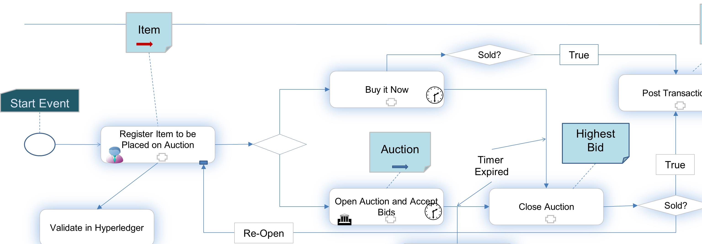

#Art Auction Blockchain Application
Credits: Ratnakar Asara, Nishi Nidamarty, Ramesh Thoomu, Adam Gordon and Mohan Venkataraman

##Introduction

This Hyperledger/Fabric The fabric is an implementation of blockchain technology, leveraging familiar and proven technologies. It is a modular architecture allowing pluggable implementations of various function. It features powerful container technology to host any mainstream language for smart contracts development. Chaincode (smart contracts) or blockchain applications run on the fabric. Chaincode is written in Go language 

The original intention of this application is to understand how to write a Go application on the Hyperledger/Fabric. This initial version was written to understand the different chaincode api's, the boundary that separates what goes into the blockchain and what lives within the enterprise application, usage of database features, error management etc.

## Application Description

This application deals with auctioning ART on the block chain. The blockchain makes sense here as there are many different stakeholders and can leverage the benifits of the "Network Effect". This application deals with the following stake holders:
* Buyers and Sellers or Traders (TRD)
* Banks (BNK)
* Insurance Companies (INS)
* Shipping and Forwarding (SHP)
* Auction Houses (AH)
* Art Dealers (DEL)
* Artists (ART)

The typical business process is shown below

1. Artists, Traders, Dealers own ART items
2. To trade on the block chain, the stakeholder has to open an account on the block chain
3. The account holder can register their items on the block chain
4. When they see an opportunity to make money, they would like to sell it, hence they engage an Auction House to place the Item on auction.
5. The Auction House (possibly will get the item validated, valued) and then decide to accept the item , place it on auction and open it up for accepting bids. They may also advertise a "BuyItNow" price
6. During the window of the auction, bidders can place bids
7. When the auction expires, the Auction House picks the highest bid and converts it to a transaction ( A  transaction in the real world could mean creating insurance and shipping docs, collecting payment and commissions, issuing a new title or certificate to the new owner etc.) and transfers ownership to the buyer and updates the price with the new "Hammer" price.

## APIs Available
The following Invoke and Query APIs are available from both CLI and REST, and have the following signature

    func(stub *shim.ChaincodeStub, function string, args []string) ([]byte, error) 

### Invoke
                * PostUser 
                * PostItem
                * PostAuctionRequest
                * PostTransaction
                * PostBid
                * OpenAuctionForBids
                * BuyItNow
                * CloseAuction
### Query
                * GetItem
                * GetUser
                * GetAuctionRequest
                * GetTransaction
                * GetBid
                * GetLastBid
                * GetHighestBid
                * GetNoOfBidsReceived
                * GetListOfBids
                * GetItemLog
                * GetItemListByCat
                * GetUserListByCat
                * GetListOfItemsOnAuc
                * GetListOfOpenAucs

##Environment Setup
Please review instructions on setting up the [Development Environment](https://github.com/hyperledger/fabric/blob/master/docs/dev-setup/devnet-setup.md) as well as the setting up the [Sandbox Environment](https://github.com/hyperledger/fabric/blob/master/docs/API/SandboxSetup.md) to execute the chaincode.

## Running the Application
###Terminal 1

* $ cd $GOPATH/src/github.com/hyperledger/fabric/peer
* $ go build
* $ ./peer peer --peer-chaincodedev

###Terminal 2

* $ cd  $GOPATH/src/github.com/hyperledger/fabric
* $ cd art/artchaincode
* $ go build art_app.go
* $ CORE_CHAINCODE_ID_NAME=mycc CORE_PEER_ADDRESS=0.0.0.0:30303 ./artchaincode

###Terminal 3

* $ cd  $GOPATH/src/github.com/hyperledger/fabric/art/scripts
* $ . ./setup.sh

###Run the following shell scripts

#### PostUsers
The PostUsers script inserts a set of users into the database. Today, the only validation done is to check if the user 
ID is an integer.
TODO: In a future version, the user identity will be validated against the IDaaS Blockchain prior to 
inserting into the database

./PostUsers

#### PostItems
The PostItems script inserts a set of ART ASSETS into the database. Before inserting the asset the chaincode checks 
if the CurrentOwner is registered as a User. Based on the image file name (in future this could be a title or some
ownership document) is retrieved and converted to a byte array ([]byte). An AES Key is generated, the byte array is encrypted
and both key and the byte array are saved in the database.A log entry is made in the Item Log. 
Please see code for detailed comments

./PostItems

In the business process, the owner (User ID# 100) of the ASSET (Item# 1000) requests an entity like an Auction House (User ID# 200) to put the item on auction. Before Posting the auction request, the Asset is validated against the database. The Auction House ID is verified in the User Table. A log entry is made in the Item Log.

TODO: In future, the owner of the asset will present his key to help with validation. 
The AES key will be used to un-encrypt the stored image and authenticate ASSET ownership. 

#### PostAuctionRequest

When the ASSET OWNER  of an item is ready to place his item on auction, he/she would identify an Auction House, determine what the reserve price should be and send a request to the Auction House expressing interest in placing their item on the auction block. 

./PostAuctionRequest

#### OpenAuctionRequestForBids

The Auction Houise, we assume will inspect the physical item, the certificate of authenticity, the ownership key and other details. They would also run a valuation of the item to determine if the reserve price is valid. The application assumes these have occured outside of the scope of the application

Even though the ASSET OWNER has requested the Auction House to place the item on auction, the Auction is not yet open for acceptance of user bids. Hence any bid submitted against the item will be rejected if the auction is not open
This script opens the Auction Request for bids. It sets the status of the AuctionRequest to "OPEN". It opens a timer for 
the duration of the auction which in the example is 3 minutes. During this window, any user can submit bids against the AuctionID. Once the timer expires, a script is created and saved called "CloseAuction.sh". The script gets triggered. 

##### CloseAuction

The CloseAuction.sh script invokes CloseAuction. 
CloseAuction will first change the status of the AuctionRequest to "CLOSED". It then fetches the highest bid from the list of bids received, and converts it to a Transaction. The transaction is posted, the ASSET is retrieved from the database, its price is set to the new Hammer Price and the CurrentOwner is set to the new buyer. The ASSET image is un-encrypted with the old key, a new Key is generated and the image is encrypted with the new key. The ASSET is updated in the database.
An log entry is made in the Item Log.

TODO: In future, the Transaction will be a business document that triggers payments, shipping,insurance and commissions

./OpenAuctionRequestForBids

Opens the auction request for bids for 3 minutes - Auction Request ID used for testing is 1111 and Item 1000
This opens a timer for 3 minutes and once timer expires, writes a shell script to invoke CloseAuction...

As described above, once the auction is "OPEN", this script submits bids against that auctionID. Both thhe auctionID and the buyerID are validated before the bid is posted. Once the auction is "CLOSED", new bids will be rejected

./Submitbids
  submits a series of bids against auction# 1111 and item# 1000

./SubmitQueries
  This is list of queries that can be issued and must be used via cut and paste on command line (CLI)

After the timer expires, the Close auction should get invoked and the highest bid should be posted as a transaction

## Runnning the Application using the Web Browser

The chaincode functions can be accessed via the browser. To kick off the application, load the index.html file via the browser. We have tested the application by pre-loading some data via the CLI and using the browser to fire up a simple auction
